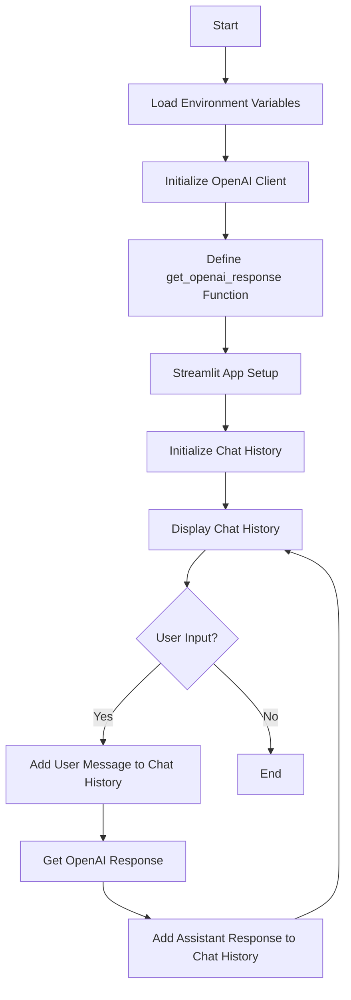
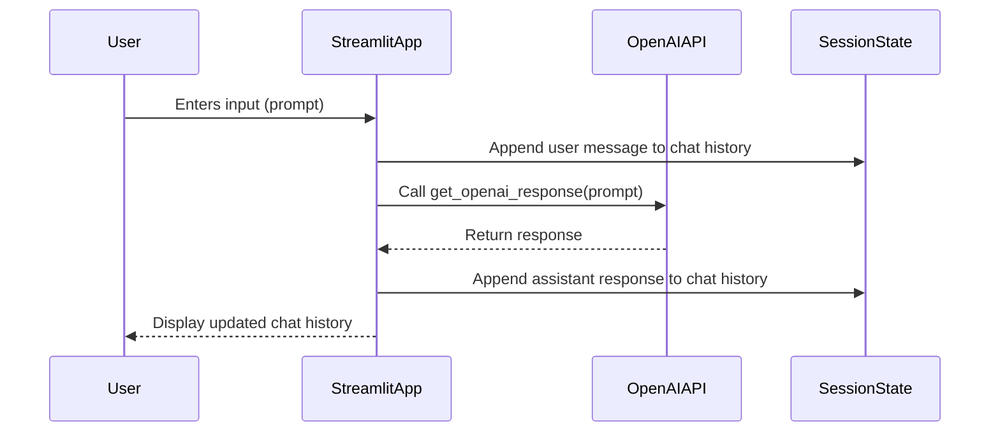

# Chatbot BSCCS103 Ethics and Computer Law
- BSCCS103 Ethics and Computer Law จริยธรรมและกฎหมายคอมพิวเตอร์

## สามารถใช้งานได้จาก 
Deployment on [streamlit](https://jeerasakananta-chatbot-bsccs103-ethics-and-computer--app-vdrxa6.streamlit.app/)

## วิธีการใช้งานพัฒนา  
- สร้าง environment ด้วย poetry 
```bash
poetry install
```
- การใช้งาน  env  
```bash
poetry shell
```
เรียกใช้งาน  app.py ด้วย  streamlit 
```bash
streamlit run app.py 
```

## drigram

- Sequence Diagram


1. พิมข้อความของคุณ

## maintainer by
- Delopment By  Jeerasak Ananta SS4 CS  RMUTL
